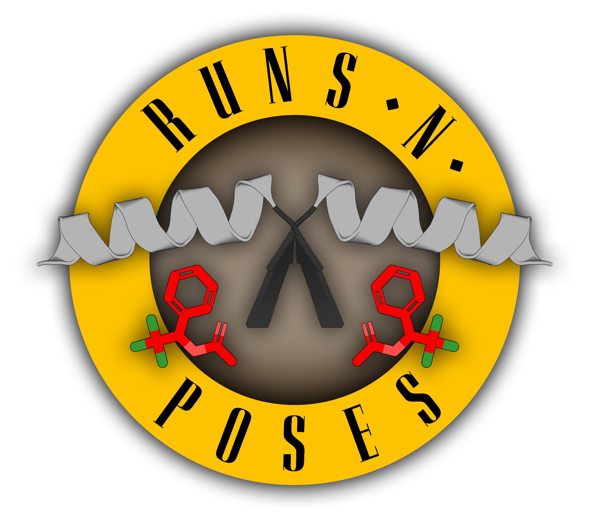

## 🌹 Runs N' Poses 🌹 - protein-ligand co-folding prediction dataset and benchmark

This repository accompanies the pre-print: ["Have protein-ligand co-folding prediction methods moved beyond memorisation?"]()

This benchmark tests the ability of protein-ligand co-folding methods to generalize to systems different from those in their training set.
This is a zero-shot benchmark, provided that your method uses a structural training cutoff of 30 September 2021.

Find ML-ready versions of the [dataset](https://polarishub.io/datasets/plinder-org/runs-n-poses-dataset) and [benchmark](https://polarishub.io/benchmarks/plinder-org/runs-n-poses) at [Polaris](https://polarishub.io/).

## Data Descriptions

The data is available in [Zenodo](https://zenodo.org/records/14794786) and consists of the following files:

### `annotations.csv`

Consists of the following columns:

- `system_id`: The PLINDER system ID which combines the PDB ID, bioassembly ID, list of protein chains, and list of ligand chains of the system
- `ligand_instance_chain`: The ligand chain ID for the system ligand defined in this row
- `group_key`: Combination of `system_id` and `ligand_instance_chain`
- `entry_pdb_id`: The PDB ID of the system
- `entry_keywords`: The keywords of the PDB entry
- `ligand_smiles`: The SMILES string of the system ligand
- `num_training_systems_with_similar_ccds`: The number of training systems with similar (>0.9 Tanimoto Morgan fingerprint similarity) CCD codes
- `cluster`: The SuCOS-pocket cluster ID of the group_key
- `target_system`: The PLINDER system ID of the closest training system calculated using SuCOS-pocket similarity
- `target_release_date`: The release date of the closest training system
- `num_ligand_chains`: The number of ligand chains in the system
- `num_protein_chains`: The number of protein chains in the system
- `ligand_is_proper`: Whether the system ligand is a proper ligand (i.e not an ion or an artifact, should be used for analysis)
- `num_proper_ligand_chains`: The number of proper ligand chains (i.e excluding ions and artifacts) in the system

Additional properties:

- `ligand_num_rot_bonds`: The number of rotatable bonds in the system ligand
- `ligand_molecular_weight`: The molecular weight of the system ligand
- `ligand_tpsa`: The topological polar surface area of the system ligand
- `ligand_num_unique_interactions`: The number of unique interactions in the system ligand
- `ligand_num_heavy_atoms`: The number of heavy atoms in the system ligand
- `ligand_num_rings`: The number of rings in the system ligand
- `ligand_num_pocket_residues`: The number of residues in the pocket of the system ligand

And additionally, all [PLINDER similarity metrics](https://plinder-org.github.io/plinder/dataset.html#clusters-clusters) are calculated for the closest training system, and the following additional similarity metrics are calculated:

- `color` and `shape`, returned by [RDKit's rdShapeAlign.AlignMol](https://www.rdkit.org/docs/source/rdkit.Chem.rdShapeAlign.html#rdkit.Chem.rdShapeAlign.AlignMol) function for the ground truth system ligand pose and the closest training system ligand pose
- `sucos_shape` returned by [SuCOS](https://github.com/susanhleung/SuCOS) calculation on the aligned ligand poses
- `tanimoto` returned by [RDKit's TanimotoSimilarity](https://www.rdkit.org/docs/source/rdkit.DataStructs.cDataStructs.html#rdkit.DataStructs.cDataStructs.TanimotoSimilarity) function for the ground truth system ligand and the closest training system ligand molecules.
- `sucos_shape_pocket_qcov`: Multiplication of the `sucos` score and the pocket coverage between the ground truth system ligand pose and the closest training system ligand pose
- `shape_pocket_qcov`: Multiplication of the `shape` score and the pocket coverage between the ground truth system ligand pose and the closest training system ligand pose
- `color_pocket_qcov`: Multiplication of the `color` score and the pocket coverage between the ground truth system ligand pose and the closest training system ligand pose

Similarity metrics all range from 0 to 100.

### `predictions.tar.gz`

Contains CSV files for each prediction method with the following columns:

- `system_id`: The PLINDER system ID of the system
- `ligand_instance_chain`: The ligand chain ID for the system ligand defined in this row
- `ligand_is_proper`: Whether the system ligand is a proper ligand (i.e not an ion or an artifact, should be used for analysis)
- `seed`: The seed used for the prediction
- `sample`: The sample number
- `ranking_score`: The ranking score of the prediction
- `prot_lig_chain_iptm_average`, `prot_lig_chain_iptm_min`, `prot_lig_chain_iptm_max`: The average, minimum, and maximum chain-pair iPTM scores calculated for the protein vs ligand chains, suffixed by `_rmsd` and `_lddt_pli` depending on which accuracy metric was used to perform the chain mapping.
- `lig_prot_chain_iptm_average`, `lig_prot_chain_iptm_min`, `lig_prot_chain_iptm_max`: The average, minimum, and maximum chain-pair iPTM scores calculated for the ligand vs protein chains, suffixed by `_rmsd` and `_lddt_pli` depending on which accuracy metric was used to perform the chain mapping.
- `model_ligand_chain`, `model_ligand_ccd_code`, `model_ligand_smiles`: The chain ID, CCD code, and SMILES string of the model ligand
- `lddt_pli`, `rmsd`, `lddt_lp`, `bb_rmsd`: The LDDT-PLI, BiSyRMSD, LDDT-LP, and backbone RMSD accuracy metrics

### `inputs.json`

Contains the information about the sequences and SMILES used as input to prediction methods for each system. Example:

```json
{
  "8cq9__1__1.B__1.I_1.J_1.K": {
    "sequences": {
      "1.B": "MTMVGLIWAQATSGVIGRGGDIPWRLPEDQAHFREITMGHTIVMGRRTWDSLPAKVRPLPGRRNVVLSRQADFMASGAEVVGSLEEALTSPETWVIGGGQVYALALPYATRCEVTEVDIGLPREAGDALAPVLDETWRGETGEWRFSRSGLRYRLYSYHRS",
      "1.A": "MTMVGLIWAQATSGVIGRGGDIPWRLPEDQAHFREITMGHTIVMGRRTWDSLPAKVRPLPGRRNVVLSRQADFMASGAEVVGSLEEALTSPETWVIGGGQVYALALPYATRCEVTEVDIGLPREAGDALAPVLDETWRGETGEWRFSRSGLRYRLYSYHRS"
    },
    "smiles": ["Nc1nc(N)c(/C=C/C2CC2)c(-c2ccc(C(F)(F)F)cc2)n1", "O=S(=O)([O-])CC[NH+]1CCOCC1", "NC(=O)C1=CN([C@@H]2O[C@H](CO[P@](=O)(O)O[P@@](=O)(O)OC[C@H]3O[C@@H](n4cnc5c(N)ncnc54)[C@H](OP(=O)(O)O)[C@@H]3O)[C@@H](O)[C@@H]2O)C=CC1"],
    "ccd_codes": ["VFU", "MES", "NDP"]
  }
}
```

### `ground_truth.tar.gz`

Consists of folders for each PLI system in the following format:

```text
ground_truth/
    <system_id>/
        ligand_files/ # SDF files of each ligand chain in the system
            <chain_id_1>.sdf
            <chain_id_2>.sdf
            ...
        receptor.cif # Receptor structure in CIF format
        sequences.fasta # FASTA file for the receptor sequences
        system.cif # System (receptors + ligands) structure in CIF format
    ...
```

### `msa_files.tar.gz`

Contains the MSA files for each system in the same fashion as seen in `examples/inputs/msa_files`.

### `train_similarity_scores.parquet`

Contains all calculated similarity metrics for Runs N' Poses dataset systems against the entire PDB. This was used to get the closest training systems based on SuCOS-pocket similarity (`sucos_shape_pocket_qcov`).

## Reproducing Figures

See `figures.ipynb` for the code used to generate the figures in the paper. This requires `predictions.tar.gz` and `annotations.csv`.

## Running Predictions

See `input_preparation.ipynb` for instructions on how to prepare the input for the four benchmarked methods. This requires `inputs.json`. See the `examples/inputs` folder for an example of an input file for each method. See `examples/utils` for example commands to run predictions with each benchmarked method. To execute those command please follow instructions on their github pages.

## Extracting Accuracy Metrics

See the `examples/utils`, `examples/analysis` and `extract_scores.ipynb` for instructions on how to run accuracy scoring and extract relevant accuracy metrics for each method. This requires `ground_truth.tar.gz`, `inputs.json` and `annotations.csv`.

## Similarity scoring

See `similarity_scoring.py` for how we calculated the similarity metrics. This requires an entire copy of the PDB, the PLINDER dataset, and large amounts of memory. The same functionality will shortly be added to [PLINDER](https://github.com/plinder-org/plinder).
The processed output of this script can be found in `train_similarity_scores.parquet`.
